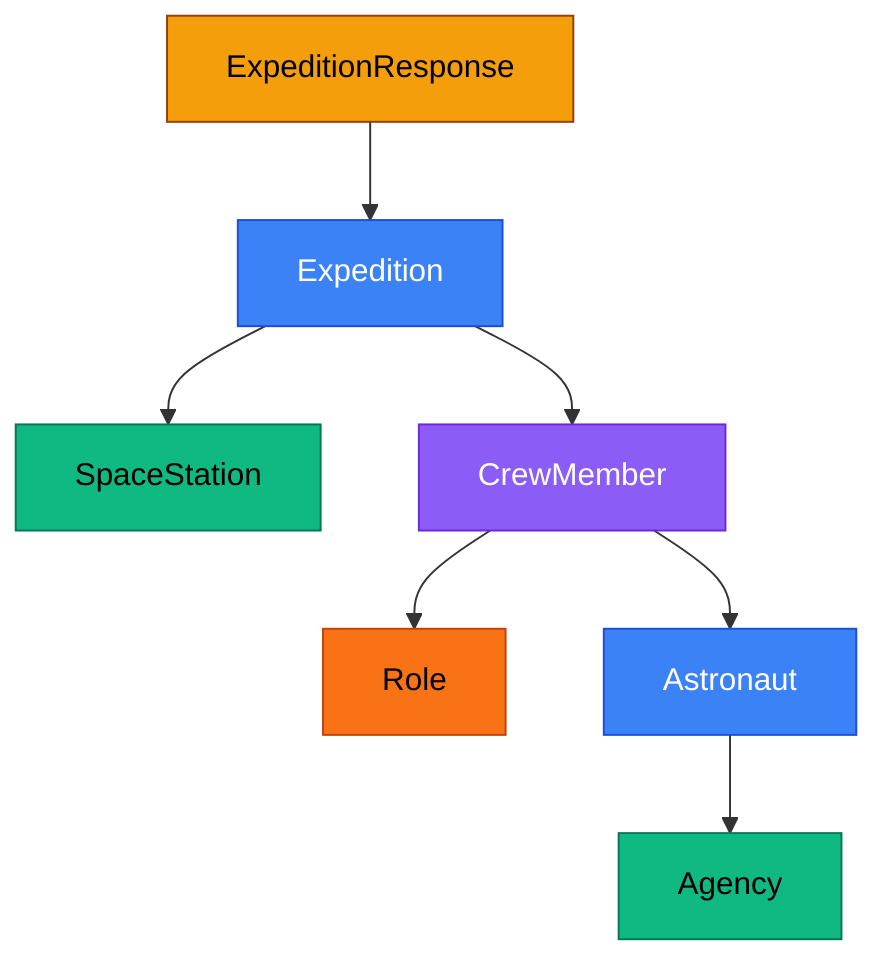

<h1 style="color: #1c1917;">A Data-Oriented Programming Approach to REST APIs</h1>

<div style="color: #92400e; font-size: 1.2em; margin-top: 0.5em;">
Records, sealed interfaces, and pattern matching<br/>
for expressive, type-safe API clients
</div>

<div style="color: #78716c; font-size: 0.95em; margin-top: 2.5em;">
Ken Kousen | DevNexus 2026
</div>

---
layout: default
background: 'linear-gradient(to bottom right, #fef3c7, #fffbeb)'
---

## <span style="color: #92400e;">Contact Info</span>

<div style="display: grid; grid-template-columns: 1fr 1fr; gap: 2rem; margin-top: 1em;">

<div style="font-size: 0.95em;">

<strong style="color: #1d4ed8; font-size: 1.2em;">Ken Kousen</strong><br/>
Kousen IT, Inc.

<div style="margin-top: 0.8em; line-height: 2;">
<a href="mailto:ken.kousen@kousenit.com" style="color: #1d4ed8;">ken.kousen@kousenit.com</a><br/>
<a href="http://www.kousenit.com" style="color: #1d4ed8;">kousenit.com</a><br/>
<a href="https://kousenit.org" style="color: #1d4ed8;">kousenit.org</a> (blog)<br/>
<a href="https://bsky.app/profile/kousenit.com" style="color: #1d4ed8;">bsky.app/profile/kousenit.com</a><br/>
<a href="https://www.linkedin.com/in/kenkousen/" style="color: #1d4ed8;">linkedin.com/in/kenkousen</a><br/>
<a href="https://foojay.social/@kenkousen" style="color: #1d4ed8;">foojay.social/@kenkousen</a>
</div>

<div style="margin-top: 0.8em;">
<em>Tales from the jar side</em> (free newsletter)<br/>
<a href="https://kenkousen.substack.com" style="color: #1d4ed8;">kenkousen.substack.com</a><br/>
<a href="https://youtube.com/@talesfromthejarside" style="color: #1d4ed8;">youtube.com/@talesfromthejarside</a>
</div>

</div>

<div style="font-size: 0.9em;">
<div style="line-height: 1.8;">
<strong>Books:</strong><br/>
<em>Help Your Boss Help You</em><br/>
<em>Kotlin Cookbook</em><br/>
<em>Modern Java Recipes</em><br/>
<em>Mockito Made Clear</em><br/>
<em>Gradle Recipes for Android</em><br/>
<em>Making Java Groovy</em>
</div>
</div>

</div>

---
background: 'linear-gradient(to bottom right, #fef3c7, #fffbeb)'
---

## <span style="color: #92400e;">What Is Data-Oriented Programming?</span>

<div style="font-size: 1.05em;">

<v-clicks>

<div style="background: rgba(180, 83, 9, 0.08); padding: 0.8em; border-radius: 8px; margin: 0.6em 0;">
<strong style="color: #92400e;">Model data as data</strong> — transparent, immutable records instead of behavior-rich objects
</div>

<div style="background: rgba(29, 78, 216, 0.08); padding: 0.8em; border-radius: 8px; margin: 0.6em 0;">
<strong style="color: #1d4ed8;">Model variety with sealed interfaces</strong> — a closed set of alternatives the compiler can reason about
</div>

<div style="background: rgba(4, 120, 87, 0.08); padding: 0.8em; border-radius: 8px; margin: 0.6em 0;">
<strong style="color: #047857;">Keep behavior separate from data</strong> — operations live in their own classes, not on the records
</div>

<div style="background: rgba(109, 40, 217, 0.08); padding: 0.8em; border-radius: 8px; margin: 0.6em 0;">
<strong style="color: #6d28d9;">Validate at the boundary</strong> — compact constructors enforce invariants once, immutability handles the rest
</div>

</v-clicks>

</div>

<v-click>

<div style="margin-top: 0.8em; padding: 0.8em; background: rgba(180, 83, 9, 0.1); border-radius: 8px; border-left: 4px solid #b45309;">
<span style="color: #78350f;">See Brian Goetz, <em>Data Oriented Programming in Java</em><br/><a href="https://www.infoq.com/articles/data-oriented-programming-java/" style="color: #1d4ed8;">https://www.infoq.com/articles/data-oriented-programming-java/</a></span>
</div>

</v-click>

---
background: 'linear-gradient(to bottom right, #fef3c7, #fffbeb)'
---

## <span style="color: #92400e;">DOP in Java — The Three Features</span>

<div style="font-size: 1.05em; margin-top: 0.5em;">

Java 21+ has everything you need:

<v-clicks>

<div style="display: grid; grid-template-columns: 1fr 1fr 1fr; gap: 1rem; margin: 1em 0;">

<div style="background: rgba(180, 83, 9, 0.1); padding: 1em; border-radius: 10px; border: 2px solid #b45309;">
<strong style="color: #92400e;">Records</strong><br/><br/>
<span style="color: #78350f;">Immutable data carriers. Transparent. Auto-generate <code>equals</code>, <code>hashCode</code>, <code>toString</code>, accessors.</span>
</div>

<div style="background: rgba(29, 78, 216, 0.1); padding: 1em; border-radius: 10px; border: 2px solid #1d4ed8;">
<strong style="color: #1d4ed8;">Sealed Interfaces</strong><br/><br/>
<span style="color: #1e3a5f;">Restrict which types can implement. Gives the compiler a <em>closed</em> set it can check exhaustively.</span>
</div>

<div style="background: rgba(4, 120, 87, 0.1); padding: 1em; border-radius: 10px; border: 2px solid #047857;">
<strong style="color: #047857;">Pattern Matching</strong><br/><br/>
<span style="color: #064e3b;">Switch expressions that deconstruct records. No <code>default</code> needed — the compiler proves you covered every case.</span>
</div>

</div>

</v-clicks>

</div>

---
background: 'linear-gradient(to bottom right, #fef3c7, #fffbeb)'
---

## <span style="color: #92400e;">The Expression Problem</span>

<div style="font-size: 0.95em; margin-top: 0.5em;">

What's easier to extend — types or operations?

<v-clicks>

<div style="display: grid; grid-template-columns: 1fr 1fr; gap: 1.5rem; margin: 1em 0;">

<div style="background: rgba(109, 40, 217, 0.1); padding: 1em; border-radius: 10px; border: 2px solid #6d28d9;">
<strong style="color: #6d28d9;">Classic OOP</strong><br/><br/>
<span style="color: #4c1d95;">Open types, fixed operations. Adding a new shape is easy — just implement the interface. Adding a new operation means modifying every class.</span>
</div>

<div style="background: rgba(180, 83, 9, 0.1); padding: 1em; border-radius: 10px; border: 2px solid #b45309;">
<strong style="color: #92400e;">Data-Oriented</strong><br/><br/>
<span style="color: #78350f;">Fixed types, open operations. The sealed hierarchy is closed. Adding a new operation is trivial — just write another function with a switch.</span>
</div>

</div>

</v-clicks>

</div>

<v-click>

<div style="padding: 0.8em; background: rgba(29, 78, 216, 0.1); border-radius: 8px; border: 2px solid #1d4ed8; text-align: center;">
<span style="color: #1e3a5f; font-size: 1.05em;">REST API data is a natural fit for DOP — the types are fixed by the API, but you keep inventing new operations over that data.</span>
</div>

</v-click>

---
background: 'linear-gradient(to bottom right, #fef3c7, #fffbeb)'
---

## <span style="color: #1d4ed8;">Example: User Types</span>

<div style="font-size: 0.95em;">

A simple sealed hierarchy — `Person` permits exactly `User` and `Admin`:

</div>

```java
public sealed interface Person permits User, Admin {}

public record User(int id, String name, String email)
        implements Person {}

public record Admin(int id, String name, String email,
                    String permissions)
        implements Person {}
```

<v-click>

Behavior lives in a separate class — exhaustive, no `default`:

```java
public static String getPersonInfo(Person person) {
    return switch (person) {
        case User user -> "User: %s (%s)".formatted(user.name(), user.email());
        case Admin admin -> "Admin: %s (%s) with permissions: %s"
                .formatted(admin.name(), admin.email(), admin.permissions());
    };
}
```

</v-click>

---
background: 'linear-gradient(to bottom right, #fef3c7, #fffbeb)'
---

## <span style="color: #1d4ed8;">Immutable Updates</span>

<div style="font-size: 0.95em;">

Records are immutable — to "update" one, you create a new instance:

</div>

```java
public static Person updateEmail(Person person, String newEmail) {
    return switch (person) {
        case User user ->
            new User(user.id(), user.name(), newEmail);
        case Admin admin ->
            new Admin(admin.id(), admin.name(), newEmail, admin.permissions());
    };
}
```

<v-click>

<div style="margin-top: 1em; padding: 0.8em; background: rgba(4, 120, 87, 0.08); border-radius: 8px; border-left: 4px solid #047857;">
<span style="color: #064e3b;">No setters, no mutation, no defensive copies. The compiler guarantees the old object is untouched. This is safe for concurrency without any synchronization.</span>
</div>

</v-click>

---
background: 'linear-gradient(135deg, #fffbeb 0%, #fef3c7 100%)'
---

## <span style="color: #92400e;">Mapping a REST API</span>

<div style="font-size: 1.05em; margin-top: 0.5em;">

The <strong style="color: #1d4ed8;">Launch Library 2 API</strong> returns active space station expeditions with deeply nested data:

</div>




---
background: 'linear-gradient(to bottom right, #fef3c7, #fffbeb)'
---

## <span style="color: #1d4ed8;">Records Map the JSON</span>

<div style="font-size: 0.9em;">

```java
public record ExpeditionResponse(int count, List<Expedition> results) {}

public record Expedition(int id, String name, String start, String end,
                         SpaceStation spacestation, List<CrewMember> crew) {}

public record SpaceStation(int id, String name, String orbit) {}

public record CrewMember(Role role, Astronaut astronaut) {}

public record Role(String role) {}

public record Astronaut(int id, String name, Agency agency) {}

public record Agency(String name, String abbrev) {}
```

</div>

<v-click>

<div style="margin-top: 0.8em; padding: 0.8em; background: rgba(180, 83, 9, 0.08); border-radius: 8px; border-left: 4px solid #b45309;">
<span style="color: #78350f;">Seven records, zero boilerplate. Gson deserializes the JSON directly into this hierarchy. No getters, no setters, no builders — just data.</span>
</div>

</v-click>

---
background: 'linear-gradient(to bottom right, #fef3c7, #fffbeb)'
---

## <span style="color: #92400e;">The Result Hierarchy</span>

<div style="font-size: 0.95em;">

A sealed interface with <strong>five</strong> variants — each carrying different data:

</div>

```java
public sealed interface Result {
    record Success(List<Expedition> expeditions) implements Result {}
    record NetworkError(String message)           implements Result {}
    record ClientError(int statusCode, String body) implements Result {}
    record ServerError(int statusCode)            implements Result {}
    record RateLimited(String retryAfter)         implements Result {}
}
```

<v-click>

<div style="display: grid; grid-template-columns: 1fr 1fr; gap: 1rem; margin-top: 0.8em;">

<div style="background: rgba(4, 120, 87, 0.08); padding: 0.7em; border-radius: 8px;">
<strong style="color: #047857;">Not a glorified if/else</strong> — five branches, each with different destructured data
</div>

<div style="background: rgba(220, 38, 38, 0.08); padding: 0.7em; border-radius: 8px;">
<strong style="color: #dc2626;">No exceptions to catch</strong> — the type system makes every failure case explicit
</div>

</div>

</v-click>

---
background: 'linear-gradient(to bottom right, #fef3c7, #fffbeb)'
---

## <span style="color: #1d4ed8;">Producing a Result</span>

<div style="font-size: 0.85em;">

The service converts HTTP status codes into the sealed hierarchy:

```java
enum StatusCategory {
    SUCCESS, RATE_LIMITED, CLIENT_ERROR, SERVER_ERROR;

    static StatusCategory of(int statusCode) {
        return switch (statusCode) {
            case 200 -> SUCCESS;
            case 429 -> RATE_LIMITED;
            default -> statusCode >= 500 ? SERVER_ERROR : CLIENT_ERROR;
        };
    }
}
```

</div>

<v-click>

<div style="font-size: 0.85em;">

```java
return switch (StatusCategory.of(response.statusCode())) {
    case SUCCESS -> {
        var body = gson.fromJson(response.body(), ExpeditionResponse.class);
        yield new Result.Success(body.results());
    }
    case RATE_LIMITED -> new Result.RateLimited(
            response.headers().firstValue("Retry-After").orElse("unknown"));
    case CLIENT_ERROR -> new Result.ClientError(response.statusCode(), response.body());
    case SERVER_ERROR -> new Result.ServerError(response.statusCode());
};
```

</div>

</v-click>

---
background: 'linear-gradient(to bottom right, #fef3c7, #fffbeb)'
---

## <span style="color: #92400e;">Consuming a Result — Record Patterns</span>

<div style="font-size: 0.85em;">

Pattern matching <strong>deconstructs</strong> each variant in a single expression:

```java
public static String describeResult(Result result) {
    return switch (result) {
        case Result.Success(var expeditions) ->
                formatExpeditions(expeditions);
        case Result.NetworkError(var message) ->
                "Network error: " + message;
        case Result.ClientError(var code, var body) ->
                "Client error %d: %s".formatted(code, body);
        case Result.ServerError(var code) ->
                "Server error %d — try again later".formatted(code);
        case Result.RateLimited(var retryAfter) ->
                "Rate limited. Retry after: " + retryAfter;
    };
}
```

</div>

<v-click>

<div style="padding: 0.8em; background: rgba(29, 78, 216, 0.1); border-radius: 8px; border: 2px solid #1d4ed8; text-align: center; margin-top: 0.5em;">
<span style="color: #1e3a5f;">No <code>default</code>. No <code>instanceof</code> checks. No casts. The compiler proves every case is handled and extracts the fields for you.</span>
</div>

</v-click>

---
background: 'linear-gradient(135deg, #fffbeb 0%, #fef3c7 100%)'
---

## <span style="color: #92400e;">Open Operations, Fixed Types</span>

<div style="font-size: 0.9em;">

The expedition records never change. We keep adding operations:

<v-clicks>

```java
// Flatten nested records into a simpler view
public static List<AstronautAssignment> toAssignments(List<Expedition> expeditions) {
    return expeditions.stream()
            .flatMap(exp -> exp.crew().stream()
                    .map(member -> new AstronautAssignment(
                            member.astronaut().name(),
                            member.role().role(),
                            member.astronaut().agency().abbrev(),
                            exp.spacestation().name())))
            .toList();
}
```

```java
// Group by station, group by agency, filter by role...
public static Map<String, List<String>> crewByStation(List<Expedition> expeditions) { ... }
public static Map<String, List<String>> crewByAgency(List<Expedition> expeditions) { ... }
public static Map<String, Long> crewCountByStation(List<Expedition> expeditions) { ... }
public static List<AstronautAssignment> filterByRole(List<Expedition> exp, String role) { ... }
```

</v-clicks>

</div>

<v-click>

<div style="padding: 0.6em; background: rgba(180, 83, 9, 0.08); border-radius: 8px; border-left: 4px solid #b45309; margin-top: 0.5em;">
<span style="color: #78350f;">This is the expression problem in action — adding a new operation never touches the data types.</span>
</div>

</v-click>

---
background: 'linear-gradient(to bottom right, #fef3c7, #fffbeb)'
---

## <span style="color: #1d4ed8;">AI Service: Claude API Records</span>

<div style="font-size: 0.85em;">

The same DOP approach for the Anthropic Claude API — two sealed interfaces:

```java
public sealed interface Message
        permits SimpleMessage, TextMessage, MixedContent {}

public record SimpleMessage(String role, String content) implements Message {}
public record TextMessage(String role, List<TextContent> content) implements Message {}
public record MixedContent(String role, List<Content> content) implements Message {}

public sealed interface Content permits TextContent, ImageContent {}

public record TextContent(String type, String text) implements Content {}
public record ImageContent(String type, ImageSource source) implements Content {
    public record ImageSource(String type, String mediaType, String data) {}
}
```

</div>

<v-click>

<div style="padding: 0.7em; background: rgba(109, 40, 217, 0.08); border-radius: 8px; border-left: 4px solid #6d28d9; margin-top: 0.5em;">
<span style="color: #4c1d95;"><code>Message</code> has three variants (text, structured text, mixed content with images). <code>Content</code> has two (text, image). The API's JSON structure maps directly to this hierarchy.</span>
</div>

</v-click>

---
background: 'linear-gradient(to bottom right, #fef3c7, #fffbeb)'
---

## <span style="color: #1d4ed8;">AI Service: Ollama Records</span>

<div style="font-size: 0.85em;">

Sealed interface for text vs. vision requests, with a compact constructor:

```java
public sealed interface OllamaRequest
        permits OllamaTextRequest, OllamaVisionRequest {}

public record OllamaTextRequest(String model, String prompt, boolean stream)
        implements OllamaRequest {}

public record OllamaVisionRequest(String model, String prompt,
                                   boolean stream, List<String> images)
        implements OllamaRequest {

    public OllamaVisionRequest {   // compact constructor
        images = images.stream()
                .map(this::encodeImage)
                .collect(Collectors.toList());
    }
}
```

</div>

<v-click>

<div style="padding: 0.7em; background: rgba(4, 120, 87, 0.08); border-radius: 8px; border-left: 4px solid #047857; margin-top: 0.5em;">
<span style="color: #064e3b;">The <strong>compact constructor</strong> is DOP's validation boundary — image paths are encoded to base64 on construction. After that, immutability guarantees the data is always valid.</span>
</div>

</v-click>

---
background: 'linear-gradient(to bottom right, #fef3c7, #fffbeb)'
---

## <span style="color: #1d4ed8;">Validation with Compact Constructors</span>

<div style="font-size: 0.95em;">

Another compact constructor — validate once, trust everywhere:

```java
public record OllamaMessage(String role, String content) {

    public OllamaMessage {    // compact constructor — no parens
        if (!List.of("user", "assistant", "system").contains(role)) {
            throw new IllegalArgumentException("Invalid role: " + role);
        }
    }
}
```

</div>

<v-click>

<div style="display: grid; grid-template-columns: 1fr 1fr; gap: 1rem; margin-top: 1em;">

<div style="background: rgba(220, 38, 38, 0.08); padding: 0.8em; border-radius: 8px;">
<strong style="color: #dc2626;">Traditional OOP</strong><br/>
Defensive checks scattered through getters, setters, and every method that touches the data
</div>

<div style="background: rgba(4, 120, 87, 0.08); padding: 0.8em; border-radius: 8px;">
<strong style="color: #047857;">DOP with records</strong><br/>
Validate once in the compact constructor. Immutability means the data can never become invalid afterward
</div>

</div>

</v-click>

---
background: 'linear-gradient(135deg, #fffbeb 0%, #fef3c7 100%)'
---

## <span style="color: #92400e;">When to Use DOP vs. OOP</span>

<div style="font-size: 0.95em; margin-top: 0.5em;">

DOP doesn't replace OOP everywhere. Ask: *what's more likely to change?*

<v-clicks>

<div style="display: grid; grid-template-columns: 1fr 1fr; gap: 1.5rem; margin: 1em 0;">

<div style="background: rgba(180, 83, 9, 0.1); padding: 1em; border-radius: 10px; border: 2px solid #b45309;">
<strong style="color: #92400e;">DOP shines when:</strong><br/><br/>
<span style="color: #78350f;">Types are fixed, operations grow<br/><br/>
REST API responses, DTOs, events, messages, AST nodes, domain commands</span>
</div>

<div style="background: rgba(109, 40, 217, 0.1); padding: 1em; border-radius: 10px; border: 2px solid #6d28d9;">
<strong style="color: #6d28d9;">OOP shines when:</strong><br/><br/>
<span style="color: #4c1d95;">Operations are fixed, types grow<br/><br/>
Plugin systems, frameworks, extensible type hierarchies where users add implementations</span>
</div>

</div>

</v-clicks>

</div>

<v-click>

<div style="padding: 0.8em; background: rgba(29, 78, 216, 0.1); border-radius: 8px; border: 2px solid #1d4ed8; text-align: center;">
<span style="color: #1e3a5f; font-size: 1.05em;">This is the <strong>expression problem</strong> (Philip Wadler, 1998). DOP and OOP are complementary tools for different shapes of problem.</span>
</div>

</v-click>

---
background: 'linear-gradient(135deg, #fffbeb 0%, #fef3c7 100%)'
---

## <span style="color: #92400e;">Where DOP Is Headed: Carrier Classes</span>

<div style="font-size: 0.9em;">

<v-clicks>

<div style="background: rgba(180, 83, 9, 0.08); padding: 0.7em; border-radius: 8px; margin: 0.5em 0;">
<strong style="color: #92400e;">First arc (what we just covered):</strong> Records + sealed interfaces + pattern matching
</div>

<div style="background: rgba(29, 78, 216, 0.08); padding: 0.7em; border-radius: 8px; margin: 0.5em 0;">
<strong style="color: #1d4ed8;">Second arc, coming next:</strong> <strong>Carrier classes</strong> — like a record but drops the commitment that representation must match the state description. Can have mutable fields, derived/cached state, representation that differs from the API.
</div>

</v-clicks>

<v-click>

```java
class Point(int x, int y) {   // class, not record!
    private component int x;   // new keyword: component
    private component int y;
    // accessors, equals, hashCode, toString all derived!
}
```

</v-click>

<v-click>

<div style="background: rgba(4, 120, 87, 0.08); padding: 0.7em; border-radius: 8px; margin: 0.5em 0;">
<strong style="color: #047857;">With expressions</strong> (JEP 468) — finally arriving for records, and carrier classes too:
</div>

```java
point = point with { x = 3; };   // non-destructive transformation
```

</v-click>

</div>

<v-click>

<div style="margin-top: 0.5em; padding: 0.8em; background: rgba(180, 83, 9, 0.1); border-radius: 8px; border: 2px solid #b45309; text-align: center;">
<span style="color: #78350f; font-size: 1.05em;">Java is fully committed to the DOP model. The trajectory is clear.</span><br/>
<span style="color: #78716c; font-size: 0.85em;">— Brian Goetz, <a href="https://mail.openjdk.org/pipermail/amber-spec-experts/2026-February/004351.html" style="color: #1d4ed8;"><em>Data Oriented Programming, Beyond Records</em></a>, Feb 2026</span>
</div>

</v-click>

---
background: 'linear-gradient(to bottom right, #fef3c7, #fffbeb)'
---

## <span style="color: #92400e;">Summary</span>

<div style="font-size: 1.05em; margin-top: 0.5em;">

<v-clicks>

<div style="background: rgba(180, 83, 9, 0.08); padding: 0.7em; border-radius: 8px; margin: 0.5em 0;">
<strong style="color: #92400e;">Records</strong> — model data as transparent, immutable values
</div>

<div style="background: rgba(29, 78, 216, 0.08); padding: 0.7em; border-radius: 8px; margin: 0.5em 0;">
<strong style="color: #1d4ed8;">Sealed interfaces</strong> — express the variety in your data as a closed set the compiler can check
</div>

<div style="background: rgba(4, 120, 87, 0.08); padding: 0.7em; border-radius: 8px; margin: 0.5em 0;">
<strong style="color: #047857;">Pattern matching</strong> — exhaustive switches with record deconstruction, no casts, no default
</div>

<div style="background: rgba(109, 40, 217, 0.08); padding: 0.7em; border-radius: 8px; margin: 0.5em 0;">
<strong style="color: #6d28d9;">Compact constructors</strong> — validate at the boundary, trust immutability downstream
</div>

<div style="background: rgba(180, 83, 9, 0.08); padding: 0.7em; border-radius: 8px; margin: 0.5em 0;">
<strong style="color: #92400e;">Behavior separate from data</strong> — functions in utility classes, not methods on records
</div>

</v-clicks>

</div>

---
background: 'linear-gradient(to bottom right, #fef3c7, #fffbeb)'
---

## <span style="color: #92400e;">GitHub Repository</span>

<div style="font-size: 1.1em; margin-top: 1.5em;">

<div style="padding: 1em; background: rgba(29, 78, 216, 0.1); border-radius: 10px; border: 2px solid #1d4ed8; text-align: center;">
<a href="https://github.com/kousen/dataorientedprogramming" style="color: #1d4ed8; font-size: 1.2em;">github.com/kousen/dataorientedprogramming</a>
</div>

<div style="margin-top: 1.5em; font-size: 0.95em;">

<v-clicks>

<div style="background: rgba(180, 83, 9, 0.08); padding: 0.6em; border-radius: 8px; margin: 0.5em 0;">
<strong style="color: #92400e;">SpaceDev</strong> — Launch Library 2 API with Result hierarchy, record patterns, separate operations
</div>

<div style="background: rgba(29, 78, 216, 0.08); padding: 0.6em; border-radius: 8px; margin: 0.5em 0;">
<strong style="color: #1d4ed8;">Anthropic</strong> — Claude API with sealed Message and Content types
</div>

<div style="background: rgba(4, 120, 87, 0.08); padding: 0.6em; border-radius: 8px; margin: 0.5em 0;">
<strong style="color: #047857;">Ollama</strong> — Text vs. Vision requests with compact constructors
</div>

<div style="background: rgba(109, 40, 217, 0.08); padding: 0.6em; border-radius: 8px; margin: 0.5em 0;">
<strong style="color: #6d28d9;">User</strong> — Simple sealed hierarchy for Person types
</div>

</v-clicks>

</div>

</div>

---
layout: cover
background: 'linear-gradient(135deg, #fef3c7 0%, #fffbeb 50%, #fef9c3 100%)'
---

<h1 style="color: #1c1917;">Thank You!</h1>

<div style="color: #92400e; font-size: 1.2em; margin-top: 1em;">
Ken Kousen
</div>

<div style="color: #78716c; font-size: 1em; margin-top: 1em; line-height: 2;">
<a href="https://kousenit.org" style="color: #1d4ed8;">kousenit.org</a> |
<a href="https://kenkousen.substack.com" style="color: #1d4ed8;">kenkousen.substack.com</a> |
<a href="https://github.com/kousen/dataorientedprogramming" style="color: #1d4ed8;">github.com/kousen/dataorientedprogramming</a>
</div>
